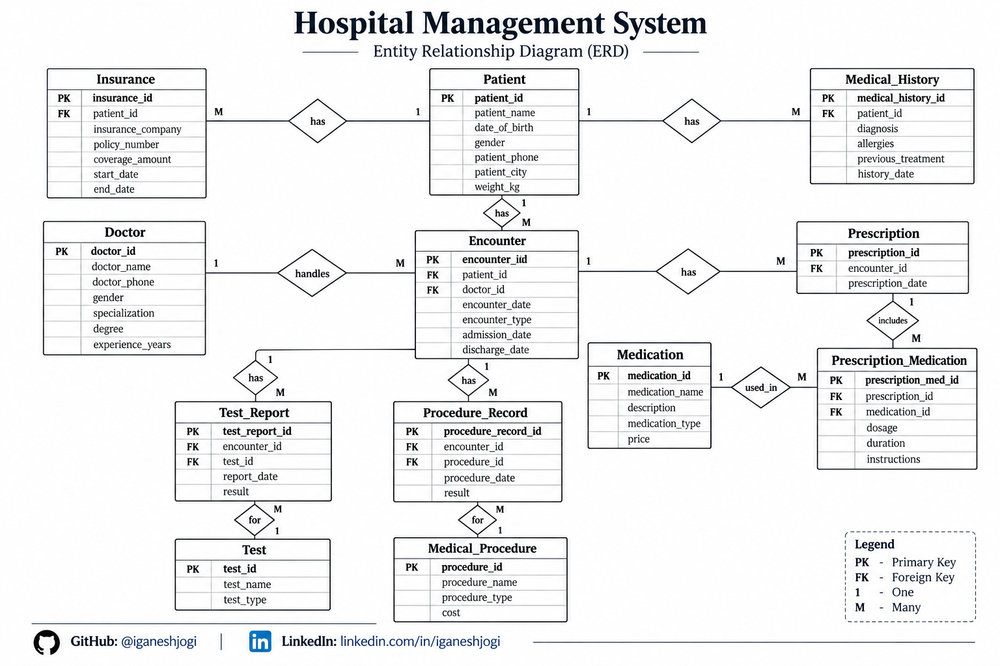

# 🏥 Hospital Management System – MySQL

A relational database project built using MySQL to manage hospital-related data such as patients, doctors, encounters, prescriptions, medications, medical tests, insurance, medical history, and medical procedures.

## 📌 Project Overview

This project demonstrates the design and implementation of a hospital management database using MySQL.

The database contains 12 related tables connected through primary keys and foreign keys.

## 🗂️ ER Diagram

The Entity Relationship Diagram represents the database entities, attributes, primary keys, foreign keys and relationships.

## 🛠️ Technologies Used

- MySQL
- SQL
- MySQL Workbench

## 🗄️ Database Structure

The database contains the following tables:

1. Patient
2. Doctor
3. Insurance
4. Medical History
5. Encounter
6. Prescription
7. Medication
8. Prescription Medication
9. Test
10. Test Report
11. Medical Procedure
12. Procedure Record

## 🔗 Main Relationships

- One patient can have multiple insurance records.
- One patient can have multiple medical history records.
- One patient can have multiple encounters.
- One doctor can handle multiple encounters.
- One encounter can have multiple prescriptions.
- One prescription can contain multiple medications.
- One medication can appear in multiple prescriptions.
- One encounter can have multiple test reports.
- One test can appear in multiple test reports.
- One encounter can have multiple procedure records.
- One medical procedure can appear in multiple procedure records.

## 💡 SQL Concepts Demonstrated

### 🔹 Basic SQL

- SELECT
- WHERE
- DISTINCT
- ORDER BY
- LIMIT
- LIKE
- BETWEEN

### 📊 Aggregate Functions

- COUNT()
- SUM()
- AVG()
- MAX()
- MIN()
- GROUP BY
- HAVING

### 🔄 Joins

- INNER JOIN
- LEFT JOIN
- Multiple-table JOINs

### 🚀 Advanced SQL

- Subqueries
- IN
- NOT IN
- EXISTS
- CASE
- Aggregate subqueries

## 📁 Project Files

### 🗃️ Database

`database/01_create_database.sql`

Creates the hospital management database.

`database/02_create_tables.sql`

Creates all 12 tables and their relationships.

`database/03_insert_data.sql`

Inserts sample data into the database.

### 🔍 Queries

`queries/01_basic_queries.sql`

Contains basic filtering, sorting and selection queries.

`queries/02_aggregate_queries.sql`

Contains aggregate functions, GROUP BY and HAVING queries.

`queries/03_join_queries.sql`

Contains queries demonstrating relationships between multiple tables.

`queries/04_advanced_queries.sql`

Contains subqueries, CASE expressions, EXISTS and other advanced SQL queries.

## ▶️ How to Run the Project

1. Install MySQL / MySQL Workbench.
2. Open `01_create_database.sql`.
3. Run the script.
4. Open `02_create_tables.sql` and run it.
5. Open `03_insert_data.sql` and run it.
6. Open the query files from the `queries` folder.
7. Run the queries to explore the database.

## 🎯 Project Objective

The objective of this project is to practice relational database design and SQL concepts using a practical hospital management scenario.

## 👨‍💻 Author

**Ganesh Jogi**

B.Tech Electrical Engineering Graduate | Aspiring Data Analyst / IT Professional
